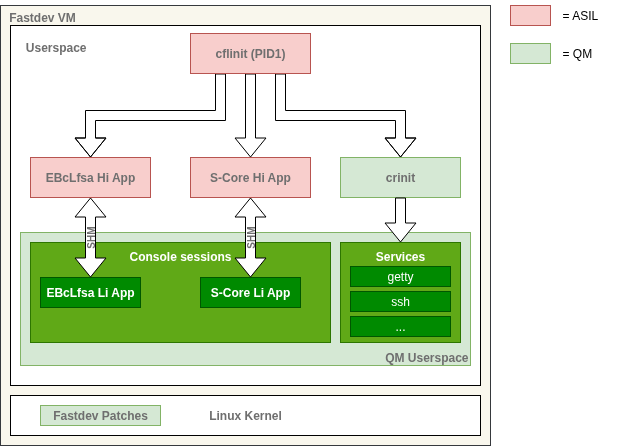

# Eclipse S-CORE on Elektrobit corbos Linux for Safety Applications

This directory shows the integration of Eclipse S-CORE on Elektrobit corbos Linux for Safety Applications.
This is an `aarch64`-based, pre-built image, capable of demonstraing the execution of high integrity applications in regular Linux user-space.
The example can be executed using QEMU.
In the [related CI workflow](../.github/workflows/build_and_test_ebclfsa.yml), all these steps are performed, and the resulting log files are stored and made available for download.

> [!TIP]
> **Quick Start**
>
> The steps performed in continuous integration can be also run interactively.
> The fastest way to achieve this is to use [GitHub Codespaces](https://github.com/features/codespaces), a cloud based development environment.
> You need a GitHub.com account for this to work.
There is a free tier of this commercial service, which is sufficient.
However, please understand that we cannot advise you about possible costs in your specific case.
> - Click on the following badge: [](https://codespaces.new/eclipse-score/reference_integration)
> - In the following dialog, make sure to select "Machine type" as "4-core".
> Click "Create codespace."
> It will take some time (2-3 minutes) for the machine to start.
> There will be a log message "Finished configuring codespace."
> - Hit "Ctrl-Shift-C" to open a new terminal.
> - Copy and paste the following command into the terminal and hit "Enter":
>
> ```bash
> bazel build --config=eb-aarch64 //images/ebclfsa_aarch64:run
> ```
>
> This will build the image.
> There may be a warning about "High codespace CPU (100%) utilization detected.", which you can ignore.
> The complete process will take around 6 minutes to complete on the 4-core machine.
>
> The expected output looks like this:
>
> ```console
> [...]
> Waiting for QEMU to be ready... (3/60)
> QEMU is accessible
> INFO: Found 1 target...
> Target //images/ebclfsa_aarch64:run up-to-date:
>   bazel-bin/images/ebclfsa_aarch64/run
> INFO: Elapsed time: 16.048s, Critical Path: 4.34s
> INFO: 2020 processes: 1502 disk cache hit, 518 internal.
> INFO: Build completed successfully, 2020 total actions
> ```
>
> The remainder of this document describes in detail what you have just accomplished.
>
> In order to close the Codespace again, first take note of the name of the Codespace.
> It is a random combination of and adjective and a noun, mentioned in the bottom left of the browser window.
> Go to your [GitHub Codespaces Dashboard](https://github.com/codespaces), find the Codespace in your list, click on the "..." in that row and select "Delete".
>
> Note that the demo can, of course, also run locally on your computer.
> Clone the repository, open it in Visual Studio Code, start the supplied Development Container, and run the demo as described above.
> This requires a setup that can run [Development Containers](https://containers.dev/) using [Visual Studio Code](https://code.visualstudio.com/).
> The [Visual Studio Code documentation](https://code.visualstudio.com/docs/devcontainers/containers) can be a good starting point; however, an in-depth explanation of this is beyond the goals of this Quick Start.

## Prebuilt Binary Assets

The whole setup is open source.
To simplify the deployment and focus on the integration itself, this demo uses pre-built binary assets.
These consist of a pre-built image and a cross-compilation toolchain.
Both assets are referenced in the corresponding Bazel targets and are automatically downloaded on demand.

The pre-built image provides a so called "fast-dev" integration for EBcLfSA,
which makes development and debugging of high integrity applications easy.
The fast-dev image itself is based on a single aarch64 Linux VM with a specially patched Linux kernel and user-space.
It checks at runtime, whether high integrity applications adhere to certain assumptions of use (AoU) of EBcLfSA.

Note that this image represents a development image but not a production image of Linux for Safety Application.
It is aimed at demonstrating development with focus on key features and AoUs.

## Main constraints for high-integrity applications

For non-safety ("low integrity") applications, Linux for Safety Applications _is_ a standard Linux system.
For applications with safety requirements, also referred to as _high integrity (HI) applications_,
Linux for Safety Applications expects few constraints, especially:

1. An HI application must be flagged with an additional checksum in its ELF-header to be detected as an high integrity application.
2. An HI application must check its registration status with the supervisor.
3. At least one HI application (e.g. a health manager) must cyclically trigger
   the watchdog of Linux for Safety Applications.
4. Few kernel system calls are not allowed to be invoked by an HI application.
   - The patches of the "fast-dev" kernel will create a log which helps you to identify them.
   - Recommendation:
     Build your HI applications and associated libraries on top of the C standard's library definition.
  Elektrobit will provide an appropriately qualified version for production projects.
5. Ask for advice when you want to modify/extend kernel functionality or invoke device-specific I/O operations.

The example application disregards the items 2-5.
They are mandatory for production systems but can be violated during development in the fast-dev environment.
For example, the items 3 and 4 only make sense in a complete system.

Current restrictions:

- HI applications must be statically linked.
- PID1 needs to be an HI process.
- HI processes can only be started by another HI process.

## Application- and Integration-Specific Violation of System Call Restrictions

The current integration setup is based on a non-safety-certified set of a toolchain and standard libraries.
As a result, an application compiled and linked with the provided example toolchain will generate system call violations.
In the communication example of the [`score_starter`](../../score_starter) this happens during application startup/teardown and is indicated by the occurrence of `ioctl`,`clone3` and `madvice` system calls.

The full product version intended for production implements process and memory management for high integrity applications according to the C Standard Library.
When using other standard library implementations, `clone3` and `madvice` might be called.
This is ok during development and will not affect you when switching to the safety compliant C Standard Library.
Avoid calling such system calls directly from HI applications, though.
The following table gives an overview why the occurred system calls are not supported and what would be the proposed alternative solution.
Keep in mind, this is only relevant if the system calls are explicitly called by the application code, or libraries other than the provided standard libraries.

| System Call | Reason | Suggested Alternative or Workaround |
|---------|--------|-------------------------------------|
| `ioctl` | Very flexible function signature, which is hard to "make safe" in a generic way. | Try to avoid direct `ioctl` calls. If direct driver interaction is needed, use alternative kernel standard interfaces like `netlink` or device file IO. A customer specific implementation of a certain function signature might be possible. |
| `clone3` | No part of C standard library. Not needed to create HI processes. | Use C standard library functions to create processes and threads (or system call `clone`). The full product version intended for production will implement them in a way that ensures safe execution. |
| `madvise` | No part of C standard library. All memory of HI Apps is pre-faulted and fully committed at allocation time, hence most kernel optimizations/hints have limited effect. | Use C standard library functions for memory management. The full product version intended for production will implement them in a way that ensures safe execution. |

## User-Space

The user-space of the pre-built image consists of three main components:

- The _trampoline application_, a simplified HI init process
- EBcLfSA example HI and LI applications
- Low integrity system init and user-space



The system itself is able to run without any Eclipse S-CORE demo applications.
Nevertheless, the trampoline application already provides an entry point for a subsequently deployed application binary.
This entry point is used by the [showcases/cli](../../showcases/cli/README.md) application.

### Trampoline App (cflinit)

The trampoline application `cflinit` acts as a simplified HI init process which starts the applications as listed above.
This includes the HI application of the EBcLfSA example, as well as a wrapper for the Eclipse S-CORE application binary.
Besides the HI applications, it starts [crinit](https://gitext.elektrobitautomotive.com/EB-Linux/crinit) as a secondary low integrity init daemon,
which brings up the regular (low integrity) Linux user-land.
Once all apps are started, it sleeps forever.

### EBcLfSA HI Demo

For technical reasons, the image contains also a secondary demo, with the executables `ebclfsa-hi-demo`,   `ebclfsa-hi-upper`,  and `ebclfsa-li-demo`.
They demonstrate message passing via a shared memory interface, which does not use Eclipse S-CORE.
Hence, they are not relevant for the demonstration and should be ignored.

### Low Integrity System Init and User-Space

As mentioned above, `crinit` is used to set up a low integrity user-land beside the high integrity applications.
This is used primarily for development and user experience by providing components like an SSH server, a login daemon, or `gdbserver`.

## Eclipse S-CORE Example

> [!IMPORTANT]
> This guide assumes that you use the SDK's [dev-container](https://github.com/eclipse-score/devcontainer).
> If you are using the Codespace as described in the Quick Start, this is the case.
> The dev-container contains all required dependencies, like `qemu-system-aarch64` and `sshpass`.

This section shows how you can use the above described SDK with the example application.
You will see how you can create a low integrity and a high integrity application, build them with the S-CORE toolchain and run them finally on Linux for Safety Applications.

The first three subsections explain the build and runtime setup.
They help you to understand the integration.
You can apply the approach on other S-CORE apps, too.

- Application Setup:
  The two application setup of the example and how to make one of them an HI application.
- S-CORE Toolchain in Linux for Safety Applications:
  The general integration of the required tools into S-CORE's Bazel toolchain.
  This should work for other applications, too.
- Bazel Rules for the Example Applications: The specific Bazel ruleset for the example

The next three sections guide you through the concrete steps of applying these rules
to build and deploy the example.

- Full Run of the Example Application
- Building the application
- Using the fast-dev image

And please also look at the shortcuts we implemented in the Visual Studio Code workspace to speed up the usage of the application example.
You find them at the end of this section.

### S-CORE Toolchain in Linux for Safety Applications

The demo SDK integrates the [S-CORE toolchain with two extensions](https://github.com/elektrobit-contrib/eclipse-score_toolchains_gcc/releases/tag/0.5.0-beta):

- Additional tooling for AArch64 cross-building.
- Additional tool `lisa-elf-enabler`: It marks an ELF header of an application in a way that Linux for Safety Applications detects it as an HI application.

## Further notes

* The toolchain and librares are provided for demonstration and prototyping purposes without further qualification.
