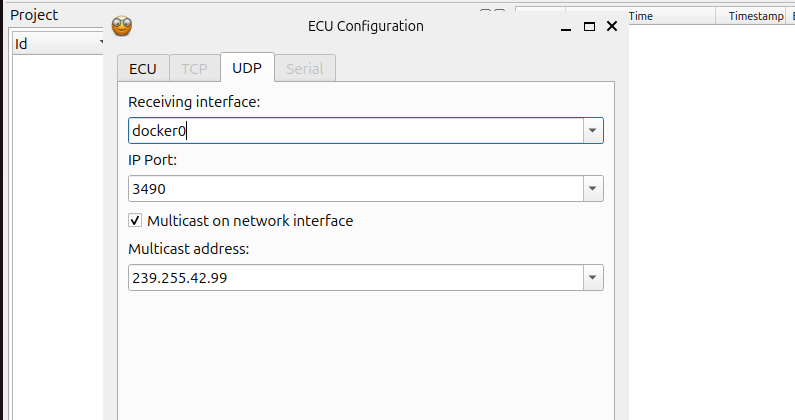
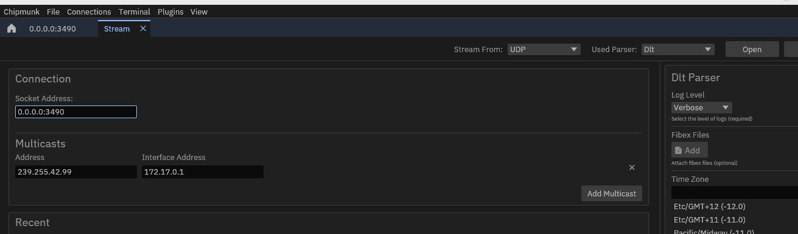
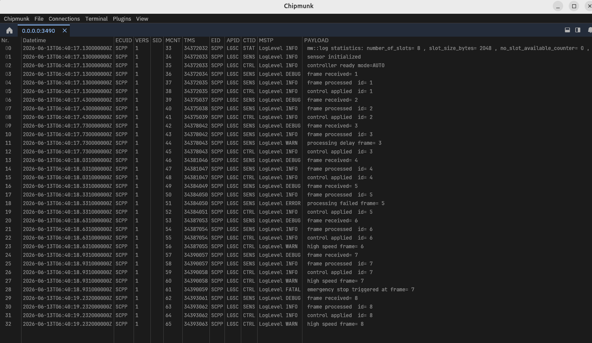

# Logging Showcase Example

## Overview

This showcase demonstrates the logging capabilities.

A new **Logging example** has been added to the showcase launcher. When running:

```bash
./score_starter
```

select **Logging example** from the menu to start the application.

The example generates log messages with different severity levels and demonstrates both local and remote logging.

---

## What the Example Shows

The application produces logs for the following levels:

- DEBUG
- INFO
- WARN
- ERROR
- FATAL

These logs can be viewed in the console as well as through remote logging tools.

---
## Remote Logging

The example forwards logs through DataRouter.

For remote logging:

- Log messages are sent to the multicast IP address `239.255.42.99` and port configured in `log-channels.json`.
- Select the appropriate network interface depending on the environment where the showcase is running. For example,   if running the showcase in a Linux x86 Docker environment, use the Docker network interface
- DataRouter receives the log stream and exposes it through the default DLT port (`3490`).
- Logs can be viewed by connecting DLT Viewer or Chipmunk to the configured DataRouter endpoint.


### DLT Viewer

DLT Viewer Configuration



### Chipmunk

Configure Chipmunk using the same network settings.



Once connected, the incoming log stream can be monitored in real time.

---

## Verification

Verify that:

- The Logging example starts successfully.
- DEBUG messages are received.
- INFO messages are received.
- WARN messages are received.
- ERROR messages are received.
- FATAL messages are received.
- Logs are visible in DLT Viewer.
- Logs are visible in Chipmunk.
- Remote log forwarding through DataRouter is working correctly.

---

## Example Log Output

### Chipmunk Logs

