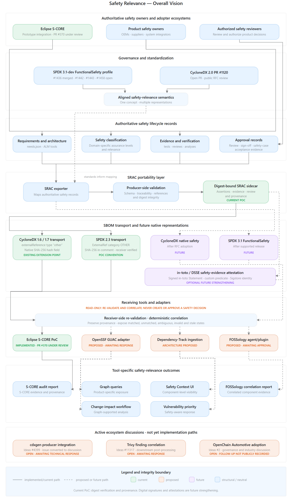

# Safety relevance — overall vision

This diagram consolidates architectural feedback received across the S-CORE,
CycloneDX, FOSSology, GUAC, Dependency-Track, and OpenSSF discussions. It
distinguishes:

- authoritative safety lifecycle sources;
- SRAC portability and producer-side validation;
- current SPDX and CycloneDX reference-based transport;
- future native standards support;
- optional signed in-toto/DSSE attestations; and
- read-only, tool-specific receiving workflows.

Solid paths represent implemented or current behavior. Dashed paths represent
proposed or future behavior. Green nodes are current, orange nodes are
proposed, purple nodes are future, and blue nodes are structural or neutral.

Receiving tools correlate, re-validate, and display authoritative safety
information. They do not autonomously create or approve safety decisions. A
tool can act as an authoring workbench only when explicitly operated under the
authority of the responsible organization.

The current PoC provides digest verification and provenance preservation.
Digital signatures and attestations remain future strengthening.

